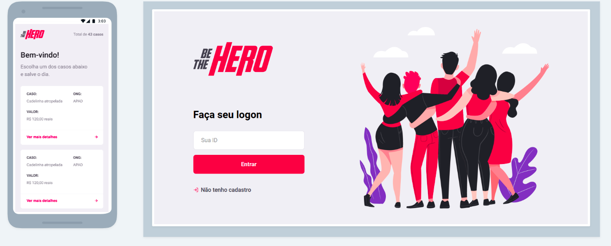

<h1 align="center">
    
</h1>

<h4 align="center">
	Semana OmniStack 11.0 da <a href="https://rocketseat.com.br/">RocketSeat</a> 🚀
</h4>

---

## 💻 Projeto

**Be The Hero** é um projeto que visa facilitar o contato entre ONG's e pessoas que desejam contribuir.

As ONG's podem cadastrar casos que estão precisando de ajuda e as pessoas interessadas em ajudar podem entrar em contato através de e-email ou whatsapp.

<h1 align="center">
  
</h1>

## 🚀 Tecnologias Utilizadas

O projeto foi desenvolvido com as seguintes tecnologias:

- [Node.js](https://nodejs.org) + [Express](https://expressjs.com/)
- [SQLite](https://www.sqlite.org/index.html) + [Knex.js](http://knexjs.org/)
- [React](https://reactjs.org)
- [React Native](https://reactnative.dev/)
- [React Icons](https://www.npmjs.com/package/react-icons)
- [Expo](https://expo.io/)
- [Nodemon](https://www.npmjs.com/package/nodemon)
- [Cors](https://www.npmjs.com/package/cors)
- [Axios](https://github.com/axios/axios)
- [Jest](https://jestjs.io)
- [Supertest](https://www.npmjs.com/package/supertest)
- [Celebrate](https://www.npmjs.com/package/celebrate)

---

## ⚙️ Como Executar 

Para clonar e rodar essa aplicação, você vai precisar do [Git](https://git-scm.com), [Node.js](https://nodejs.org) e [Npm](https://www.npmjs.com/) instalados em sua máquina, após:

```bash
# Clone esse repositório
$ git clone https://github.com/cristhianbreunig/be-the-hero
```

Back-end:
```bash
# Entre no diretório backend
$ cd be-the-hero/backend

# Instale as dependências
$ npm install

# Crie o banco de dados SQLite
$ npx knex migrate:latest 

# Inicie o servidor
$ npm start
```

* Instale o [Insomnia](https://insomnia.rest/download/)

* Após, para testar as rotas, baixe o arquivo das <a href=".github/requisicoes_insomnia.json">requisições</a> e importe o mesmo no Insomnia, através do menu Application -> Preferences -> Data -> Import Data -> From File;

---

Front-end:
```bash
# Entre no diretório frontend
$ cd be-the-hero/frontend

# Instale as dependências
$ npm install

# Inicie o servidor
$ npm start
```
* Acesse http://localhost:3000/ no seu navegador

---

Para executar a aplicação mobile, você vai precisar instalar o Expo no seu celular, após

Mobile:
```bash
# Entre no diretório mobile
$ cd be-the-hero/mobile

# Instale as dependências
$ npm install

# Inicie o servidor
$ expo start
```
* Após iniciar o servidor, a interface web do expo será aberta automaticamente, então abra o aplicativo Expo do seu celular e selecione a opção "Scan QR Code" e aponte para o código gerado, com isso a aplicação será aberta no seu celular.

* Verifique se a "baseUrl" do arquivo mobile/src/services/api.js está igual à exibida na interface web do expo.

---

## 🤔 Como contribuir

- Faça um fork desse repositório;
- Crie uma branch com a sua feature: `git checkout -b feature`;
- Faça commit das suas alterações: `git commit -m 'feat: Minha feature'`;
- Faça push para a sua branch: `git push origin feature`.

Depois que o merge da sua pull request for feito, você pode deletar a sua branch.


---

## :memo: License

Esse projeto está sob a licença MIT. Veja o arquivo [LICENSE](LICENSE.md) para mais detalhes.

